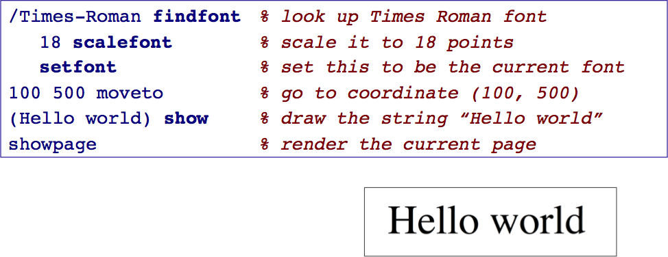

# Programming Languages

This repo contains the lecture material for the MSc level course “Programming Languages”.

## Description

Programming languages are the means by which we instruct a computer to perform tasks for us. We use different programming languages to accomplish different tasks, but what really are the differences between various languages?

In this course we adopt the viewpoint that programming is modeling, so different programming languages offer us different ways to model our applications. We will examine a number of different paradigms for programming, and in each case look at one or more concrete examples of programming languages that support that paradigm. Specifically we will look at languages like Postscript, Haskell, Prolog, JavaScript and EToys. We will also take a brief look at the semantics of programming languages, and we will see how semantic descriptions can be made directly executable to obtain a rapid prototype of a language.

## Learning Outcomes

On successful completion of this course, you will be able to:

- distinguish the key programming paradigms and know how to apply them
- know how to program a stack machine
- understand different forms of polymorphism
- exercise basic skills in functional programming
- understand how the lambda calculus offers a basic semantic foundation for programming
- understand the role of static typing in object-oriented programming
- exercise basic skills in logic programming

## Slides

The slides have been prepared with Apple Keynote. Interspersed with the slideware are hidden slides containing notes for students. PDF versions of the slides can be found [here](http://scg.unibe.ch/download/lectures/pl/).

The figures for the slides have mostly been prepared using [OmniGraffle](https://www.omnigroup.com/omnigraffle/).

## Repo

This repo lives on [github](https://github.com/onierstrasz/course-programming-languages).
Further resources can be found on the [course web site](http://scg.unibe.ch/teaching/pl).

This work is licensed under a [Creative Commons Attribution-ShareAlike 4.0 International License](http://creativecommons.org/licenses/by-sa/4.0/).

---
